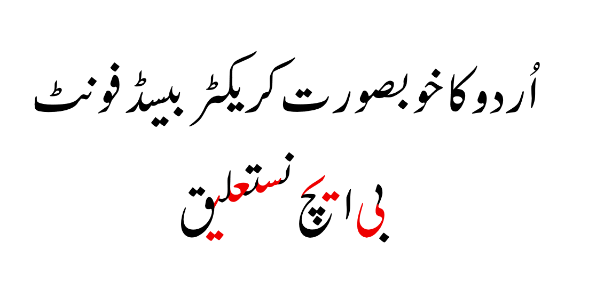

# BH Nastaliq

[](https://scripts.sil.org/OFL)

**BH Nastaliq** is a contemporary Urdu typeface designed to bridge the gap between traditional calligraphy and modern digital requirements. Commissioned by **Beaconhouse** and engineered by **Mehr Type**, this font offers a sophisticated, high-performance Nastaliq solution for the web, publishing, and education.



## About the Project

BH Nastaliq was developed to address the need for a legible, aesthetically pleasing Urdu font that performs well on screens of all sizes. Unlike traditional Nastaliq fonts that often suffer from complex rendering issues or slow load times, BH Nastaliq is optimized for the web without compromising the intricate beauty of the script.

## Authors and Contributors

This project is a collaborative effort between:

* **Beaconhouse** (Commissioning Body & Copyright Holder)
    * Website: [https://www.beaconhouse.net/](https://www.beaconhouse.net/)
    * *Beaconhouse is one of the world's largest private school networks, committed to educational excellence and cultural preservation.*

* **Mehr Type** (Design & Development)
    * Website: [https://mehrtype.com/](https://mehrtype.com/)
    * *Mehr Type is a premier type foundry specializing in Arabic and Urdu script engineering.*

## License

This Font Software is licensed under the SIL Open Font License, Version 1.1.
This license is copied below, and is also available with a FAQ at:
[https://scripts.sil.org/OFL](https://scripts.sil.org/OFL)

## Repository Structure

* `sources/`: Contains the source files (UFO / Glyphs) for the font.
* `fonts/`: Contains the final binary font files (TTF/OTF).
* `documentation/`: Contains images and promotional materials.

## Building from Source

To build the font files from the source, you can use the standard tools for font engineering.

1.  **Install dependencies:**
    ```bash
    pip install fontmake gftools
    ```

2.  **Build the font:**
    ```bash
    gftools builder sources/config.yaml
    ```
    *(Note: If you are not using a config.yaml, you can run `fontmake -g sources/BHNastaliq.glyphs -o variable`)*


---
**Copyright (c) 2025 The BH Nastaliq Project Authors.**
